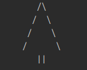
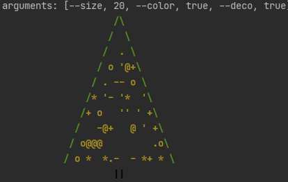
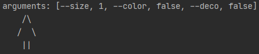

#1) Создать проект на дарте

#2) Нарисовать в консоли ёлочку подобного вида

Высота (количество рядов) должна настраиваться параметром, в этом примере их 4, но может быть больше. 
Максимальная высота должна быть 10 рядов, минимально 2. 
Елка должна создаваться при любом указанном количестве, не выдавая ошибок. 
Можно добавить какие-то опции от себя, например, изменение толщины ствола или что-то еще. 
Это будет плюсом

#3) Запушить проект в гитхаб, вместе со скриншотом консоли, в которой он рисует елочку

#4) Дать нам ссылку на него

### ChristmasTree(\[arguments\])

#### arguments

##### size

Type: `number` 
Default: `4`

##### color 

Type: `boolean` 
Default: `false`

##### deco

Type: `boolean` 
Default: `false`

#Examples

